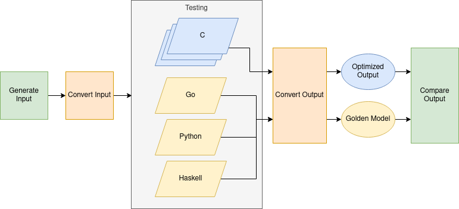

# Team 7

## Overview



## Building

For reproducible builds we use [docker](https://www.docker.com/get-started) in combination with [make](https://www.gnu.org/software/make).
We have two makefiles: one in the docker container [`docker.mk`](docker.mk) and [`Makefile`](Makefile) locally.
The file `docker.mk` contains the building recipies that are executed inside the docker container defined in
the [`Dockerfile`](Dockerfile). The local [`Makefile`](Makefile) executes make commands in the docker container
and the results end up in the `build/` directory.

To build the optimized code run

```bash
$ make
```

To list available targets, run

```bash
$ make list
```

### How to add Stuff I want to build?

1. Make sure the toolchain required to build the program is present in the container or add it in the [`Dockerfile`](Dockerfile).
2. Add a recipe in `docker.mk` that is executed in the docker container. Make sure that the output goes
   into the build directory (use the `${BUILD_DIR}` variable) and that the recipe for the optimized code
   stays at the top.
3. Add a recipe in the `Makefile` which runs the appropriate `make` target in the container. Use
   `docker run ${DOCKER_RUN_ARGS} make <target in docker.mk>` as a template.

## Generate a graph AKA testcase input

```bash
$ make generate-graph
```

## Run a reference implementation AKA testcase output

```bash
$ make run-go-reg-shortest-path
$ make run-python-reg-shortest-path
```

## Run the C implementation AKA unit under test

```bash
$ make run-c-naive-shortest-path
```
